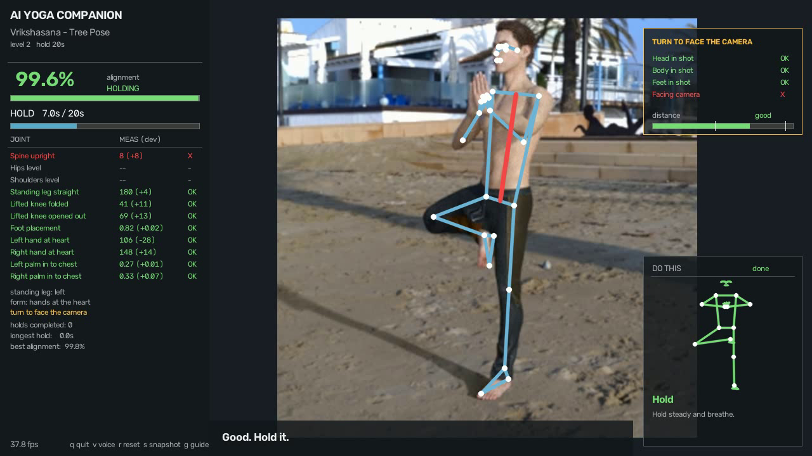
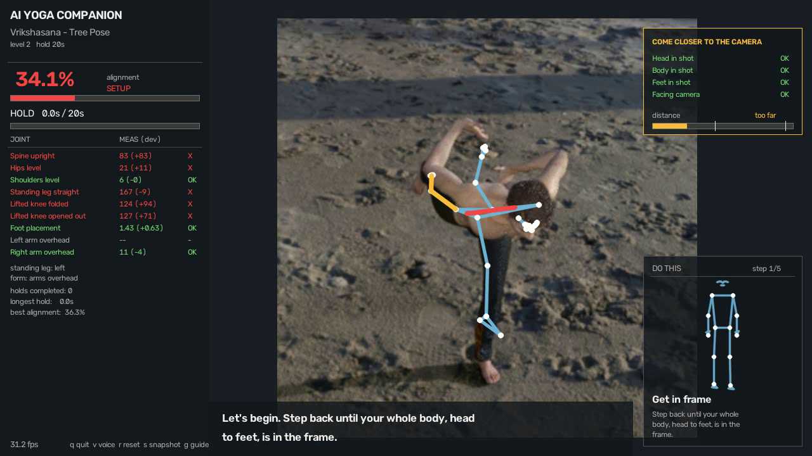
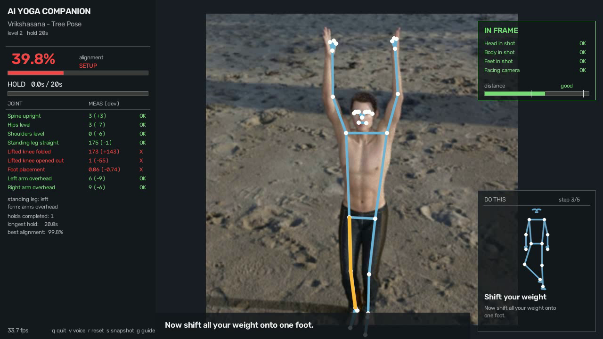

# AI Yoga Posture & Wellness Companion

One webcam corrects your asana **live, while you hold it** — a real-time trainer,
not a photo classifier. It tracks 33 body landmarks, compares every joint against
a reference fitted from a public dataset, speaks the single most useful
correction, times the hold, and keeps a private practice log.

Final-year project, Department of Computer Engineering, K.C. College of
Engineering and Management Studies and Research, Thane.

This repository is the **base implementation**: the full pipeline working end to
end for one asana — **Vrikshasana (Tree Pose)**.



```
webcam ──▶ BlazePose (33 landmarks) ──▶ joint angles ──▶ compare with the
reference asana ──▶ alignment score + hold timer ──▶ spoken correction
                                                  └──▶ SQLite practice log
```

**No video is ever written to disk.** Frames are used and discarded; only derived
numbers are stored, on your own machine.

---

## Quick start

**Any laptop, one command.** Clone it and run:

```bash
python bootstrap.py          # sets up, repairs anything broken, verifies
python bootstrap.py --run    # start the live trainer
```

`bootstrap.py` is a self-healing installer: every requirement is a *check* paired
with a *repair*, run in a loop until the environment is green. It finds a Python
that MediaPipe actually has wheels for, builds the virtualenv, installs the
dependencies, downloads the pose model (retrying, and verifying it is not
truncated), and runs the engine self-test. It is safe to re-run at any time —
that is also how you diagnose a broken install:

```bash
python bootstrap.py --check  # diagnose only, change nothing
```

<details>
<summary>Other commands (each repairs the environment first)</summary>

```bash
python bootstrap.py --test        # 66 engine checks, no camera needed
python bootstrap.py --run         # live trainer
python bootstrap.py --calibrate   # learn your own tolerances
python bootstrap.py --demo        # scripted 90s practice through the real pipeline
python bootstrap.py --report      # practice history
python bootstrap.py --dataset     # fetch the dataset used for the reference
python bootstrap.py --fit         # re-derive the reference angles
python bootstrap.py --validate    # held-out validation against 4 other asanas
```

With `make`: `make setup | test | run | doctor | demo | dataset | docker`.
On Windows without `make`: `setup.bat`, `run.bat`, `test.bat`.
</details>

### Docker

No Python at all? Every number in the docs is reproducible from a container:

```bash
docker compose run --rm verify    # 66 engine checks
docker compose run --rm session   # scripted practice + progress report
docker compose run --rm dataset   # refit the reference, rerun the validation
```

The image bakes in the pose model and **runs the self-test during the build**, so
a green image means a green engine.

The live trainer needs a webcam and a window. On Linux the container can have
both (`xhost +local:docker && docker compose run --rm live`). On Windows and
macOS Docker cannot reach a webcam — run the trainer natively there, which
`python bootstrap.py --run` sets up in one command.

**Requires** Python 3.9–3.12 for a native install (MediaPipe publishes no wheels
for 3.13+) — or just Docker.

Keys while running: `q` quit · `v` voice · `g` guide panels · `r` reset · `s` snapshot.

---

## What it does

**It talks you into the pose**, then corrects you. Five guided steps, each waiting
for your body to actually do it before moving on:

> *"Step back until your whole body, head to feet, is in the frame."* → *"Stand tall
> with your feet together."* → *"Now shift all your weight onto one foot."* → *"Bend
> the other knee, open it out to the side, and press that foot into your inner
> thigh."* → *"Bring your palms together at your heart, or reach both arms
> overhead."* → *"Good. Hold it, and breathe."* → **10 · 5 · 3 · 2 · 1** → *"Well held.
> Lower your foot slowly, and stand on the other leg."*

Already in the pose? It skips straight through — nobody sits through the script
needlessly.

| | |
|---|---|
|  |  |
| The **IN FRAME** panel shows whether the camera can see your head, body and feet, how far away you are, and the one thing to fix next. | The **reference card** shows the shape to make and which step you are on, cycling through both accepted arm forms. |

**One correction at a time.** A fault must persist a second before it is spoken,
each cue has its own cooldown, and a repeated fault escalates from a soft reminder
to a firm one. Somebody balancing with their eyes closed can act on one
instruction, not four.

**It knows there is more than one right answer.** Vrikshasana is taught with the
hands overhead *or* pressed at the heart. Both are scored and the better match
wins, so you are corrected towards the form you are actually attempting.

---

## The reference angles are fitted, not guessed

There is **no standard published table of ideal joint angles per asana** — the
papers that do angle-based correction each derive their own from data, and mostly
never print the numbers. So this project derives them and writes them down.

Fitted from 195 tree-pose images of the public TensorFlow/Moroney yoga dataset:
target = median, tolerance = 1.5 × robust σ. Reproduce with
`python bootstrap.py --fit`.

Three things the data overturned:

- **The hips are not level.** Fitted median 10° off horizontal even head-on — the
  pelvis genuinely hikes over the standing leg. A target of 0°, the obvious
  guess, would have corrected every correct practitioner.
- **The lifted ankle is half-occluded by definition** (median visibility 0.50) —
  it is pressed into the standing thigh. A strict visibility gate was refusing
  the pose *for being the pose*, discarding 174 of 200 correct images.
- **The arms are bimodal**, and every subject appeared in both clusters — two
  accepted forms, not two kinds of practitioner. The elbow checks a first pass
  included were deleted: they cut across the forms and do not discriminate.

**Held-out validation** — reference fitted on the train split, then every image of
the untouched test split of five asanas scored against Vrikshasana:

| class | n | mean score | ≥ 78 % threshold |
|---|---|---|---|
| **tree** | 95 | **90.1 %** | **94 %** |
| chair | 84 | 29.8 % | 0 % |
| cobra | 84 | 27.6 % | 0 % |
| dog | 39 | 32.4 % | 0 % |
| warrior | 83 | 29.8 % | 0 % |

**precision 1.000 · recall 0.937 · F1 0.967 · AUC 1.000** — 89 of 95 tree images
accepted, **0 of 290** images of other asanas. Reproduce with
`python bootstrap.py --validate`.

Method, citations and the limitations of that sample:
**[docs/REFERENCES.md](docs/REFERENCES.md)**.

---

## Verified without a camera

`python bootstrap.py --test` runs **66 checks**, all offline:

* **Geometry** — skeletons built with a known spine lean, hip tilt, thigh opening
  and foot height measure back to within 0.6° and 0.02.
* **Fault attribution** — six deliberately wrong poses each name the correct
  primary fault.
* **Scoring** — one badly wrong joint denies the hold even when every other joint
  is perfect (the score is weakest-link, not an average).
* **Hold timer** — a 0.7 s wobble does not end a hold; a 2 s loss does.
* **Cue rules** — silent for the first second, cooldown respected, escalation soft
  → firm, and a correct pose is never nagged.
* **Visibility** — a half-occluded lifted foot is still graded; an invisible leg
  ungrades only its own checks; a hidden torso says "step back".

Plus `--demo`, which drives a scripted 90-second practice — sloppy start,
correction, full hold, failed attempt, clean hold — through the real evaluator,
state machine, cue engine and logger, and asserts that two holds complete.

**Measured performance** (1000×667, CPU only, Intel i7-13xxx): 13.9 ms landmark
inference + 0.13 ms scoring per frame; 28 fps end to end including the overlay.

---

## Layout

```
bootstrap.py               self-healing setup, doctor and task runner
app.py                     live trainer (webcam / video / calibration)
yoga/
  landmarks.py             MediaPipe BlazePose wrapper -> Pose object
  filters.py               One-Euro filter, rolling mean
  angles.py                joint geometry in image space
  asanas.py                the asana library - fitted reference + variants
  evaluator.py             measure the body, score it joint by joint
  state_machine.py         SETUP / HOLDING / COMPLETE, hold timer, hysteresis
  coach.py                 the spoken guided entry into the pose
  feedback.py              which cue, when to say it, and the TTS thread
  overlay.py               skeleton, HUD, reference card, framing panel
  reference.py             the ideal figure, shared by the card and the tests
  calibration.py           personal tolerance profile
  storage.py               SQLite practice log (derived numbers only)
tools/
  selftest.py              66 engine checks on synthetic skeletons
  fit_reference.py         derive the reference angles from a dataset
  validate_dataset.py      held-out validation against other asanas
  analyse.py               headless run over a clip/photo -> per-frame CSV
  simulate_session.py      scripted practice through the real pipeline
  demo_frames.py           render the overlay to PNGs
  report.py                practice history / recurring weakness report
  get_dataset.py           fetch the public dataset
docs/IMPLEMENTATION.md     design decisions and stage-by-stage mapping
docs/REFERENCES.md         literature, dataset, fitted angles, validation
```

---

## Status

Implemented: the asana-trainer track, complete, for Vrikshasana — guided entry,
landmark extraction, jitter filtering, joint geometry, per-joint comparison,
weakest-link scoring, pose variants, hold timing, spoken correction, personal
calibration, the live overlay, the practice log, and the offline evaluation
harness.

Next: more asanas (one `Asana(...)` entry and one fitting run each), desk-posture
mode, contactless vitals (rPPG), an LLM phrasing layer (the hook is in place),
and packaging.

---

## Boundaries

Wellness and education, **not a medical device**. The alignment score is a
geometric agreement measure against a fitted reference, not a clinical or
certified assessment, and it does not replace a teacher. The camera window is
visible the whole time and no frame is saved unless you press `s`.

## Licence

MIT — see [LICENSE](LICENSE). Third-party attribution in [NOTICE](NOTICE):
MediaPipe (Apache-2.0) and the TensorFlow yoga-pose dataset (Apache-2.0).
